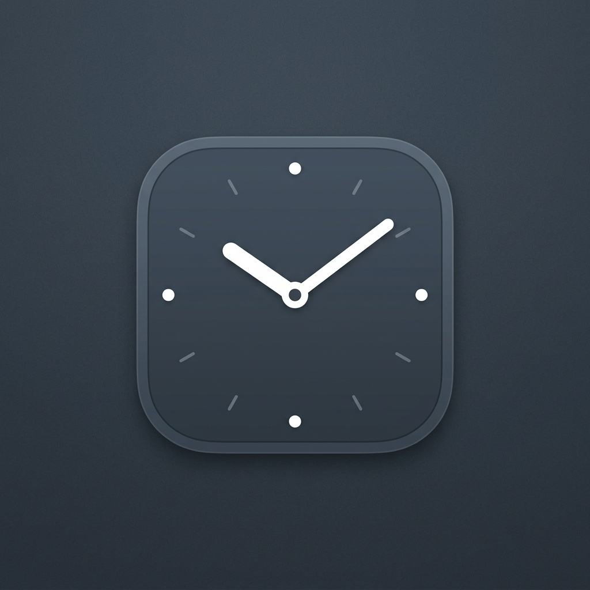

# Timezone Tray Clock

一个精致、轻量的 Windows 桌面时钟小部件，支持多时区显示，并带有系统托盘管理功能。



## ✨ 特性

- **多时区支持**：不仅可以显示本地时间，还可以配置为任意 Windows 支持的时区。
- **极致轻量**：基于 .NET 8 WPF 构建，内存占用极低。
- **现代化设计**：
  - 支持 Windows 深色/浅色模式，并可自动跟随系统。
  - 毛玻璃阴影效果。
  - 完美支持高 DPI (Per-Monitor v2)。
- **鼠标穿透**：开启后，鼠标点击将直接穿透时钟窗口，不影响您操作背后的桌面内容。
- **位置记忆**：自动记忆您拖拽后的屏幕位置。
- **系统托盘**：提供便捷的右键菜单，一键管理所有设置。
- **开机自启**：支持随 Windows 启动而自动运行。

## 🚀 编译与运行

### 环境要求
- Windows 10 / 11
- [.NET 8.0 Desktop Runtime](https://dotnet.microsoft.com/download/dotnet/8.0) 或更高版本

### 编译
如果您本地安装了 .NET 8 SDK，可以在项目根目录运行：
```powershell
dotnet build
```

或者发布为独立的单文件程序（无需用户预装 .NET 运行时）：
```powershell
dotnet publish -c Release -r win-x64 --self-contained true -p:PublishSingleFile=true
```

### 运行
运行编译后的 `timezone-tray-clock.exe`。
此时您的桌面上会浮现时钟，系统托盘（右下角）也会出现一个时钟图标。

## ⚙️ 使用说明

- **移动时钟**：使用鼠标左键按住时钟并拖动（前提是未开启“鼠标穿透”）。
- **设置**：右键点击系统托盘中的图标，可以进行以下设置：
  - 开启/关闭 **开机自启动**
  - 开启/关闭 **锁定位置(鼠标穿透)**
  - 切换 **主题颜色** (跟随系统 / 始终深色 / 始终浅色)
  - 退出程序

## 🛠️ 配置

程序的部分高级配置可以通过直接修改源码或稍后引入配置文件实现。
目前，默认时区在代码中配置：
```csharp
private const string TargetTimeZoneId = "China Standard Time";
```
您可以将其修改为任何有效的 Windows 时区 ID，如 `"Tokyo Standard Time"` 或 `"Pacific Standard Time"`。
